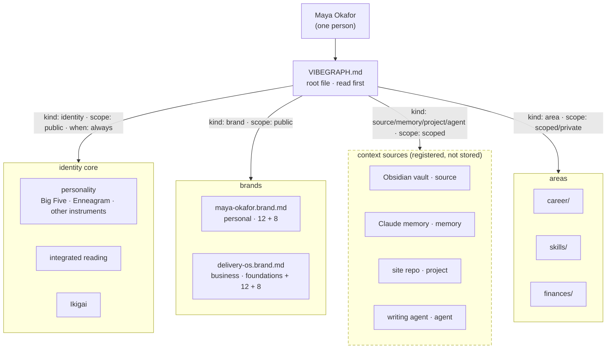
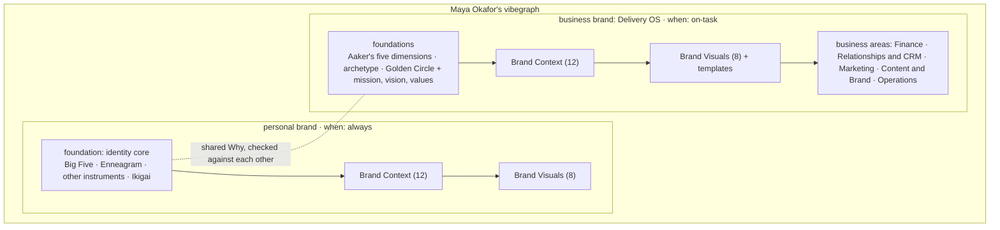
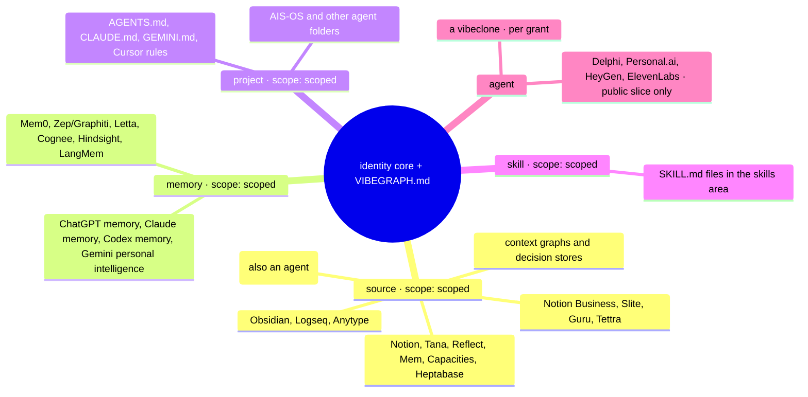
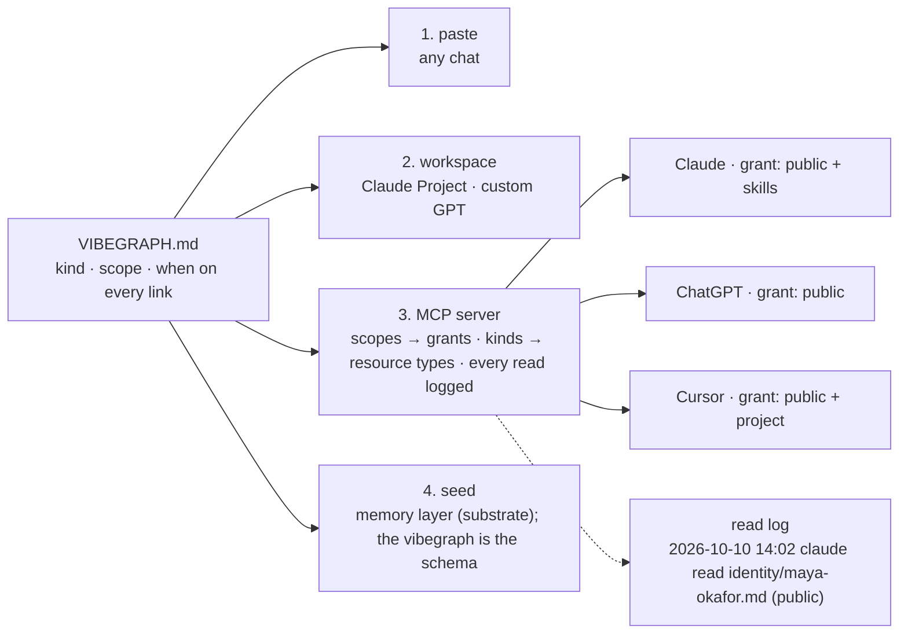

# Figure specs for the whitepaper

Companion to [`../vibegraph-whitepaper.md`](../vibegraph-whitepaper.md). Each figure has a Mermaid source (renders on GitHub) and a build spec for the SVG that goes into the PDF. [`build_figures.py`](build_figures.py) implements the build specs and writes the four SVGs in this folder:

```
python3 build_figures.py
```

Palette, from the brand system's light mode (Figma file x48b72CU3Bv4bvgTwtOBH7, node 19:959, the desktop light page for vibegraph.ai): background #f6f6f6, cards #ffffff, foreground #0a0a0a, muted #6b6b6b, border #e2e2e2, accent #5a4bd1, with a soft accent tint on figure 3's ring. Type: Space Grotesk Medium for titles, Inter for labels, IBM Plex Mono for file names and key-value pairs.

## Figure 1: the anatomy of a vibegraph

File: `figure-1-anatomy.svg`

**What it shows.** One owner at the top. VIBEGRAPH.md as a single root node directly beneath. Four children fanning out: identity core (with three sub-nodes: personality, integrated reading, Ikigai), brands (personal brand, and a nested business brand box inside the brands region), context sources (four example registered systems drawn with a dashed border to mean "registered, not stored"), areas (three example folders). Every edge from the root carries a small mono label with kind and scope.

**Mermaid source.**



**Build spec.** Canvas 1200 × 800. Owner label centered at top in Space Grotesk 26. Root node 320 × 64, accent stroke, IBM Plex Mono file name. Four regions on one row beneath, each 260 wide with 24 gutters, region titles in Inter SemiBold 15, lowercase. The business brand box sits inside the brands region, inset 16, with a thin accent left rule to read as "nested." Context sources region border dashed (6 4). Edge labels in IBM Plex Mono 10.5, muted. No arrowheads on edges from the root to regions; arrowhead only from owner to root.

## Figure 2: a business brand inside its owner's vibegraph

File: `figure-2-business-brand.svg`

**What it shows.** Two columns inside one outer frame labeled with the owner's name, so the nesting is literal. Left column: the personal brand's foundation (identity core: Big Five, Enneagram, other instruments, Ikigai) feeding its 12 + 8. Right column: the business brand's foundation (Aaker's five dimensions, archetype, Golden Circle with mission, vision, values) feeding the same 12 + 8. Between the two foundations, a connector labeled "shared Why, checked against each other." Below the right column, a strip of business areas (Finance, Relationships and CRM, Marketing, Content and Brand, Operations). Under the whole figure, one line: personal `when: always`, business `when: on-task`.

**Mermaid source.**



**Build spec.** Canvas 1200 × 720. Outer frame with the owner's name top-left in Space Grotesk 22. Two equal columns. Foundation blocks 120 tall with the instruments as a mono list. The 12 and 8 blocks identical in both columns to make "same shape" visible. Dotted connector between foundations, label in Inter 12 italic. Business areas strip 56 tall with four mono chips. Bottom caption strip in IBM Plex Mono 11: "personal · when: always | business · when: on-task (any Delivery OS writing, design, or publishing)".

## Figure 3: where existing tools fit

File: `figure-3-where-tools-fit.svg`

**What it shows.** A radial map. Center: a filled accent disc labeled "identity core + VIBEGRAPH.md." Around it, five wedges, one per context source kind (source, memory, project, skill, agent), each holding the tools from the whitepaper's section 6 table as small chips. A thin accent ring labeled "scope: scoped." The agent wedge is split: the vibeclone inside the ring, labeled "per grant," and the clone platforms outside it in a "public slice only" band. A small legend: filled = built here, chips = registered.

**Mermaid source (as a mindmap, the closest Mermaid form).**



**Build spec.** Canvas 1000 × 1000. Center disc radius 110, accent fill, two-line label in Space Grotesk 18, light text on the accent. Five wedges at 72° each, separated by hairline rules in border color, wedge titles in Inter SemiBold 14 with the kind in mono after a middle dot. Chips: 1px border, 6px radius, Inter 12, muted text. Scope ring at radius 390, 1px accent, labeled once. Clone platforms placed outside the ring in a lighter band labeled "public slice only." Legend bottom-right.

## Figure 4: the root file and the four consumption modes

File: `figure-4-root-file-and-consumption.svg`

**What it shows.** Left third: a rendered miniature of VIBEGRAPH.md (the section 7.1 example) with the kind, scope, when, and type keys highlighted in accent. Right two-thirds: four horizontal lanes, each starting from the root file. Lane 1 "paste": an arrow into a chat window. Lane 2 "workspace": an arrow into a Claude Project or custom GPT box. Lane 3 "MCP": an arrow into a server box labeled "scopes become grants · kinds become resource types · every read logged," then fanning to three client boxes (Claude, ChatGPT, Cursor) each with a small grant badge. Lane 4 "seed": an arrow into a memory-layer box with the line "substrate; the vibegraph is the schema." Under lane 3, a small read-log strip showing three sample log lines in mono.

**Mermaid source.**



**Build spec.** Canvas 1400 × 760. Left panel 420 wide, dark card with the miniature root file in IBM Plex Mono, keys in accent. Four lanes on the right. Lane labels in Space Grotesk 16 with the number. MCP server box 360 wide with its three-clause label in mono 11. Client boxes 200 wide with a grant badge (accent outline pill, mono 10). Read-log strip 3 lines, mono 10, muted. Arrows 1.5px, foreground color, small arrowheads.
