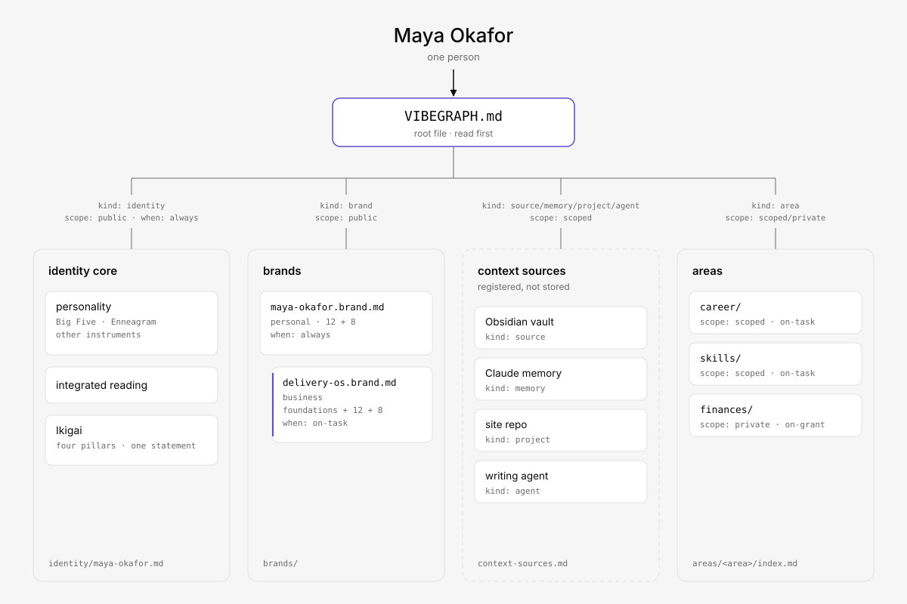
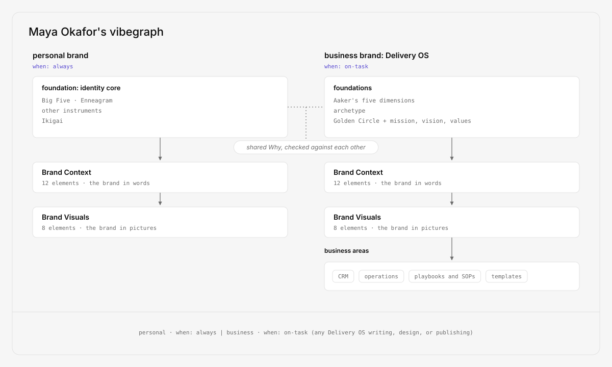
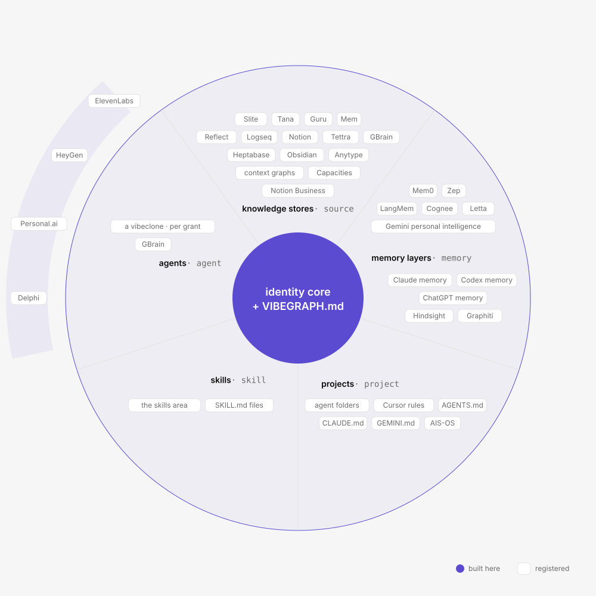
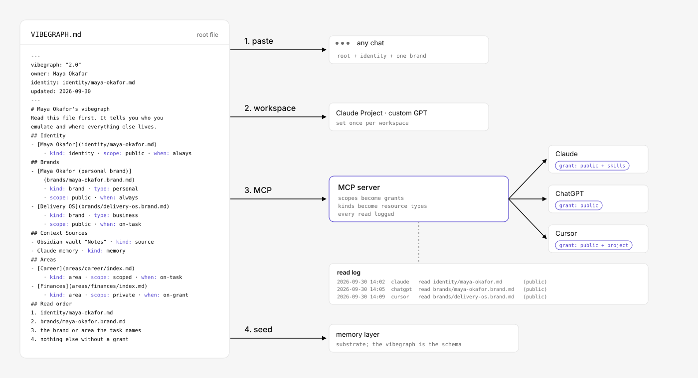

# The vibegraph: your vibes, codified

A vibegraph is the network of identity, context, knowledge, and memory that governs how AI thinks, writes, and acts for one person, and any businesses they own or operate.

**Version 3.0 · October 2026 · Ryan Charleston · vibegraph.md · vibegraph.ai**

---

## Introduction

Every AI tool you use starts from zero. It does not know your voice, your values, your goals, or your taste. So it guesses, and it guesses toward the statistical average. The result is output that could belong to anyone, which is another way of saying it belongs to no one.

Your vibes (your personality, taste, voice, values, purpose, and aesthetic) are the things AI gets wrong about you by default, because nobody wrote them down anywhere a machine could read them. This paper is about writing them down, once, in a form every AI you use can read first.

The word for the result is a vibegraph. **A vibegraph is the network of identity, context, knowledge, and memory that governs how AI thinks, writes, and acts for one person, and any businesses they own or operate.** Everyone who uses AI for real work already has one, spread across a notes app, a folder of documents, a few platform memories, and a great deal that lives only in their head. What separates a working vibegraph from a pile of context is small and specific: a human-authored identity core, and a root file with a fixed name that any agent reads first.

This paper defines the term, describes the anatomy of a vibegraph, shows where the tools people already use fit inside one, explains how business brands nest inside their owner's graph, specifies how AI systems consume one (by paste, by workspace, over the Model Context Protocol, and as a seed for memory layers), states the security model such a thing demands and which parts of it are shipped, and separates the three things that share the name: the noun, the open framework at vibegraph.md, and the guided builder at vibegraph.ai.

> Memory layers remember what happened. A vibegraph defines who you are.

---

## 1. The problem: AI does not know who you are

Large language models are trained on the written output of millions of people and optimized to produce the most probable response. Probable means average. When a model knows nothing about you, the average is the best it can do.

Anyone who uses AI for real work has felt the consequences.

**You repeat yourself constantly.** Every new chat, every new tool, every new agent begins with the same ritual: here is who I am, here is what I do, here is how I write, here is what I am working on. The context you type into one tool is gone the moment you open another.

**The output is generic.** Ask ten professionals in the same field to generate a post on the same topic and the results are nearly interchangeable, because the model draws on the same averaged prior for all ten. The people who notice most are the ones with the most to lose: creators, coaches, consultants, and founders whose voice is the business. Generic output erodes that voice with every draft.

**Platform memory does not solve it, and adds a problem of its own.** ChatGPT remembers some things about you. Claude remembers other things. Gemini calls its version personal intelligence. None of them can see the others, you cannot fully inspect any of them, and none of it moves when a better tool ships next quarter. What they accumulate is a history of what you did, filtered through what a model happened to notice. That is not a deliberate statement of who you are today, and it does not track who you are becoming.

**Agents raise the stakes.** A chatbot that misreads your tone wastes a prompt. An autonomous agent that misreads your intent sends the email, books the meeting, publishes the post. The gap between "AI that knows you" and "AI that guesses" stops being a quality issue and becomes a trust issue.

The software industry already solved a version of this for code. AGENTS.md, a plain markdown file at the root of a repository, tells coding agents how a project works. It spread to tens of thousands of repositories in its first year and to several hundred thousand root-level files by September 2026, read natively by Codex, Cursor, Copilot, Gemini CLI, and more than twenty other tools, because the payoff was immediate: write the file once, and every agent that touches the codebase gets better on the next task. No committee, no SDK, no permission from anyone. SKILL.md did the same for procedures in under ninety days. llms.txt is doing it, more slowly, for websites.

There is no equivalent for a person. That is the gap a vibegraph fills.

> Where AGENTS.md tells an agent how to work on your code, a vibegraph tells an agent how to work not just for you, but as you.

---

## 2. What is a vibegraph?

A vibegraph is the network of identity, context, knowledge, and memory that governs how AI thinks, writes, and acts for one person, and any businesses they own or operate.

They may not realize it, but everyone who uses AI for real work already has a vibegraph. It is just spread across a notes app, local folders, cloud drives, fragmented memory inside various AI chat apps and agents, a system prompt pasted from a text file, a CLAUDE.md file, and important context that lives only in the person's head and gets retyped into every new tool. That's a vibegraph in the way a shoebox of photos is an album: all the material, none of the structure, and no way for a machine to read it properly.

A vibegraph is an attempt to understand and organize that context in the following ways:

1. **An identity core.** A human-authored statement of who the person is, built from validated instruments rather than inferred thinly from behavior: a two-part personality assessment (the Big Five via the IPIP-NEO-120, and the Enneagram, reconciled in one integrated reading), any further instruments the person has taken, a four-pillar Ikigai, and a personal brand (twelve Brand Context elements and eight Brand Visuals elements). Business brands the person owns sit beside the personal brand, built with organizational instruments (Aaker's dimensions, a Jungian archetype, the Golden Circle). The core is small, stable, and safe to share. It is the part every AI interaction should start from.

2. **A root file.** A single markdown file, always named VIBEGRAPH.md, always at the root, that any agent reads first. It says who the agent is working for or working as, links every part of the graph with a kind and a scope, and states the read order. It is to a vibegraph what index.html is to a website and what AGENTS.md is to a repository.

3. **Context sources and areas, linked by scope.** Context sources are the systems that already hold context: an Obsidian vault, a Notion workspace, a memory layer such as Mem0 or Zep, a project's AGENTS.md, an agent that runs on the graph. Areas are the domains the person adds when a real use case demands one (career, money, health, tech, goals, and on the business side finance, CRM, marketing, content, operations), each listing entries that point into those sources with a route to reach them. The root file registers each with a kind (identity, brand, area, source, memory, project, skill, agent) and a scope (public, scoped, private). Nothing is exposed by omission.

The identity core and the root file are what make it a vibegraph. Without them, it is context. With them, it is a graph any agent can walk, a permission model an owner can reason about, and a portable asset that moves unchanged when a better tool ships.

**What a vibegraph is not.** It is not a notes app, a memory layer, or an AI operating system; those are context sources or consumers of it. It is not shared. A single vibegraph represents exactly one human, and there is no global vibegraph. A business brand inside a person's vibegraph can be shared with other people inside that business, but the graph itself has one owner. A vibegraph is not scraped. A core vibegraph is written on purpose, through assessment and brand work, not inferred from an inbox. It is plain markdown at its simplest and an encrypted, permissioned vault at its most complete, owned and hosted by the person it describes.

Two design decisions separate a vibegraph from the memory products it composes with. Memory layers remember what happened; a vibegraph defines who you are. And a vibegraph works today, with zero platform adoption required. Use it with your AI tools and the output becomes something that matches the "vibes" of its creator; high-fidelity, high-quality results that are the opposite of AI slop. Where AGENTS.md tells an agent how to work on your code, a vibegraph tells an agent how to work as, and for, you.

The word is a common noun. "vibegraph" (lowercase v) is not a product name and carries no trademark. The open framework and file convention are published at vibegraph.md under a permissive MIT license. A guided builder for the identity core is available at vibegraph.ai. Neither is required to have a vibegraph; both exist to make a good one faster.

### 2.1 Design principles

**Human-authored, not scraped.** The core is built deliberately, through structured self-assessment and brand work, not inferred from an inbox. Passive inference produces a model's opinion of you. A vibegraph is your statement of record. The two coexist: a vibegraph makes an excellent seed and correction layer for passive memory systems.

**Useful on day one, with zero adoption required.** A vibegraph delivers its value the moment its owner pastes the core into any AI tool. Proposed standards that depended on platform adoption have a poor record; the ones that won gave individual users an immediate payoff with the tools they already had. The framework is designed for the second pattern.

**One person per vibegraph.** A vibegraph represents exactly one human. The businesses that person owns nest inside it as business brands. There is no global vibegraph, and nothing in the framework pools graphs across people.

**Nothing is exposed by omission.** Every link in the root file carries a scope. Anything without one is private. An agent that was never granted a part of the graph cannot read it, and cannot leak it.

**Guided, not blank.** The hard part of a document like this is not the format; it is the blank page. The framework assumes a guided build: structured questions, worked examples for every element, and an AI coach that draws out real material in conversation rather than waiting for the owner to fill a template.

**Portable and sovereign.** A vibegraph is files, not a service. It moves across tools, models, and vendors unchanged. If a platform shuts down or a better one launches, the graph comes along.

**Grounded in established instruments.** The identity core is not improvised. It uses instruments and frameworks with decades of practice behind them, so the result is structured, comparable, and complete rather than a freeform "about me" essay. More instruments make a richer core; the framework welcomes any the owner has taken.

**Extensible.** A minimal vibegraph is an identity core, one personal brand, and a root file. From there the owner adds business brands, context sources, and areas as real needs appear, at whatever depth they choose.

---

## 3. The anatomy of a vibegraph

Every vibegraph has the same five elements, anchored to one person.

**The identity core** answers the question every AI tool silently asks and never gets answered: who is this person? It holds the personality assessment, the integrated reading, any other instruments the owner has taken, and the purpose work. It is deliberately small, because it travels everywhere: pasted into a chat, attached to a project, read first by an agent.

**Brands** answer the next question: how does this person present? A vibegraph holds one personal brand, built from the identity core, and any business brands the owner operates, each a full brand document of its own with organizational foundations. Every brand has its words (Brand Context) and its look (Brand Visuals). The core plus one brand fits inside a single model context window; that is a design constraint, not an accident.

**Areas** answer the follow-up: what is this person working with? Areas are the domains of knowledge and working context the owner adds when a use case demands one. On the personal side: career, finances, health, skills, goals. On the business side: relationships and CRM, operations, playbooks and SOPs, templates. Each area is a folder with its own index file and its own scope, so it can be granted as a unit. Areas are where depth lives, and where sensitivity lives, which is why they are gated by default and stay home when the core travels. Each area lists its entries: files, links, and locations with a scope, a when, and an `access` route (`file`, `link`, `mcp`, `ask`) that tells a reader how to reach them, and which context source holds them. A vibegraph carries routes, never credentials.

**Context sources** are the systems that already hold context: a notes app, a memory layer, a project repository with its own AGENTS.md, a skill file, an agent. The root file registers them; it does not store them. This is how the framework says "everything you already use is part of your vibegraph" without pretending to be a container for it. Section 6 places the common tools.

**The root file**, VIBEGRAPH.md, ties the four together. It names the owner, points to the identity file, links every brand, context source, and area with a kind, a scope, and a rule for when to read it, and states the read order. An agent handed only this file knows what exists, what to read first, and what it may not read.

The structure matters for three reasons.

First, it matches how AI consumption works. Identity and brand belong in every interaction; area context belongs only in relevant ones. A model writing your newsletter needs your voice and positioning, not your medical history. Separating the always-relevant from the sometimes-relevant keeps context windows lean and permission decisions simple.

Second, it matches how trust works. The core and the brands are shareable by design. Areas are gated by design. Context sources are registered, not copied. A clean line is easier to secure and easier to reason about than one blob with per-paragraph exceptions.

Third, it scales in both directions. A minimal vibegraph (core, one brand, root file) is useful the day it is built. A large one, with two business brands, a dozen areas, and six registered context sources maintained over years, is still one file an agent reads first. The framework does not force anyone up the curve.



*Figure 1: the anatomy of a vibegraph. One owner, one root file, an identity core, brands (personal plus nested business brands), context sources, and areas, with every link carrying a kind and a scope.*

---

## 4. Inside the identity core

### 4.1 Personality: two built-in instruments, and any others you bring

The foundation is a personality assessment in two parts, using two instruments that approach the same person with different methods of questioning.

**Part one: the Big Five.** A Big Five assessment measuring Openness, Conscientiousness, Extraversion, Agreeableness, and Neuroticism, administered through the IPIP-NEO-120, a public-domain, research-grade inventory. The Big Five anchors the assessment because it is the model with the strongest empirical support in personality psychology, and because it produces dimensional scores rather than type labels. Dimensional data is what a machine can use: "high openness, moderate extraversion, low neuroticism" gives a model calibration that a four-letter type does not. The identity file stores the domain scores, the facet breakdown, and a written interpretation in the owner's own words.

**Part two: the Enneagram.** The Enneagram asks a different kind of question: not how you behave, but why. Where the Big Five measures traits, the Enneagram surfaces core motivations, fears, and the patterns a person falls into under stress and growth. It is a typology, and the framework uses it as one: a second angle of questioning that dimensional scores alone do not capture.

**Any other instrument.** The two built-in instruments are a floor, not a ceiling. Owners can add the results of any assessment they have taken: 16personalities, CliftonStrengths, DISC, HEXACO, a Truity Enneagram, an attachment-style inventory, anything. These are recorded as named sources with the document's own figures and scale words, never converted onto another instrument's scale, and summarized in plain language. The more instruments a person brings, the richer and more cross-checked the core becomes. The framework expects the list of instruments to grow, and the identity file carries them as a list.

**The integrated reading.** All of it is reconciled in a single written interpretation: where the instruments agree, where they tension, and what the combination means for how this person works, decides, and communicates. This reading, in the owner's own words after review, is the paragraph most AI consumers use; the underlying scores stay available for tools that want them.

### 4.2 Purpose: a four-pillar Ikigai

The second layer codifies meaning and direction through a four-pillar Ikigai structure: what you love, what the world needs from you, what you are naturally good at, and what you can be paid for. Where the pop-culture Venn diagram reduces purpose to a career sweet spot, this treatment keeps the pillars distinct, examines where they meet, and produces a richer artifact: four honest self-statements, a synthesis of their intersections, and a single Ikigai statement, the sentence the rest of the graph builds on. For an AI consumer, this layer turns "write a post about productivity" into a post about productivity that connects to what its author cares about.

### 4.3 The personal brand: Brand Context

The personal brand's first half is twelve elements that define the brand in words:

1. Brand Name
2. Taglines & Slogans
3. Unique Value Proposition
4. Purpose-Vision-Mission
5. Core Values
6. Tone & Voice
7. Messaging & Narratives
8. Keywords & Phrases
9. Bio (Short/Long)
10. Achievements & Awards
11. Inspiration & Influence
12. Online Presence

Each element is a small, opinionated artifact with a defined shape: core values as decision filters with the behavior that proves them, a value proposition in one tested sentence, messaging as repeatable statements each paired with the story that makes it believable. The shapes matter because the consumer is a machine: a model handed twelve well-formed elements writes exactly like the owner; a model handed just an essay writes like an AI model.

### 4.4 The personal brand: Brand Visuals

The second half is eight elements that define the brand in pictures:

1. Symbols & Logos
2. Color Palette
3. Typography
4. Iconography
5. Brand Imagery
6. Illustration Style
7. Visual Elements
8. Photography

The visual elements are concrete artifacts rather than vague direction: hex values, typeface pairings, a described logo and where its master file lives, imagery rules, and photography direction. The framework records and links these; it does not require any particular tool to produce them. In practice the owner takes the finished Brand Context and a set of prompts into whichever design tool they prefer (a general model, a code agent, a design canvas, a design application), produces the assets there, and records where each asset lives. When an AI tool later generates a slide, a thumbnail, or a landing page, this is the layer that keeps it on-brand without a design review.

Together, the identity core and the personal brand give any AI system what a good ghostwriter, a good designer, and a good strategist would each need a dozen sessions to absorb.

---

## 5. Business brands

A vibegraph represents one human being, and that is the design, not a limitation. The people this framework serves best, initially, are solo operators, founders, creators, and owners of small firms who do not experience their business as a separate self. They experience it as something they own and express. The framework models that directly: business brands live inside their owner's vibegraph, one full brand document per business, beside the personal brand.

The sequence is deliberate. Business brands are built after the owner's identity and personal brand, because the founder's material is the business brand's raw material. A business cannot take a personality test, and an Ikigai does not describe a company, so the business brand swaps the identity instruments for organizational equivalents and keeps the same Brand Context and Brand Visuals structure.

### 5.1 Foundations

**Brand personality: Aaker's five dimensions.** In place of the Big Five, a business brand uses Jennifer Aaker's brand personality framework (Sincerity, Excitement, Competence, Sophistication, Ruggedness), the closest thing brand research has to an empirically derived trait model for organizations. Like the Big Five, it produces dimensional calibration rather than a slogan.

**Brand character: a Jungian archetype.** Aaker's dimensions describe a brand's personality; an archetype (Sage, Creator, Hero, Outlaw, Caregiver, and the rest) gives it a coherent character to write and design from. The two work together: choose the archetype, then use the dimensions to describe and measure how it shows up.

**Purpose: the Golden Circle, mission, vision, values.** In place of the Ikigai, a business brand codifies purpose through Simon Sinek's Why, How, and What, alongside conventional mission, vision, and values. Small businesses that run on EOS can drop their Vision/Traction Organizer in nearly unchanged. Sinek designed the Golden Circle to apply to individuals as well as organizations, which gives the personal and business brands inside one vibegraph a shared spine: the founder's Why and the company's Why are written in the same shape and checked against each other, in the same graph.

### 5.2 The same twelve and eight

After the foundations, a business brand carries the same twelve Brand Context elements and eight Brand Visuals elements as the personal brand. The reading of some elements shifts: Messaging & Narratives carries the category point of view and the audience; Bio carries the boilerplates a business repeats in bylines and press. The visuals become a design system with templates for the assets a business produces repeatedly. The shapes are the same, so a tool that reads one brand file reads them all.

### 5.3 When a business brand is read

In the root file, the personal brand is `when: always`. A business brand is `when: on-task`, with the tasks named: "any Delivery OS writing, design, or publishing." An agent drafting the owner's newsletter reads the personal brand; an agent drafting the company's landing page reads both, with the business brand governing. This is the difference between a founder who sounds like themselves and a company that sounds like its founder when it should not.

### 5.4 Business areas

A business brand brings its own areas, and they shift from life domains to operating knowledge: relationships and CRM, finances, operations, playbooks and SOPs, management routines, templates, goals. A personal system optimizes for one person's recall. A business system optimizes for repeatability: any operator following the same playbook should get the same result. That is why SOPs and templates, which barely appear on the personal side, are the center of gravity on the business side. It is also why the business side of a vibegraph suits agents: an SOP written clearly enough for a new hire is most of the way to a protocol an agent can run.

### 5.5 What maps, what does not

| Personal brand | Business brand | Relationship |
|---|---|---|
| Big Five + Enneagram + other instruments | Aaker's five dimensions + archetype | Replaced: same job (personality calibration), different instruments |
| Ikigai | Golden Circle + mission, vision, values | Replaced: same job (purpose), shared Why structure |
| Brand Context, 12 elements | Brand Context, twelve elements | Carries over nearly intact |
| Brand Visuals, 8 elements | Brand Visuals, eight elements, plus templates | Carries over, deepens |
| Personal areas | Business areas | Restructured around repeatability |
| `when: always` | `when: on-task` | The founder governs by default; the business governs its own tasks |

A solo operator needs both, and a vibegraph holds them side by side by design: the personal brand governs voice and identity; the business brand governs the machine that sells and delivers. One person, one graph, every brand they own.

### 5.6 Out of scope: the organizational vibegraph

A standalone organizational vibegraph (a company as first-class owner, with no single human anchor) is a plausible extension and nothing in the format precludes it. It is deliberately not part of this framework. The person-anchored model serves the framework's first audience, and an organization-anchored variant deserves its own treatment rather than a premature parallel.



*Figure 2: a business brand nested inside its owner's vibegraph. Foundations swapped for organizational instruments, the same twelve and eight, read on-task, with business areas built for repeatability.*

---

## 6. Where existing tools fit

A vibegraph is not a competitor to the tools a person already uses. Each of them is a context source of that person's vibegraph, with a kind the root file assigns and a scope that usually fits. This table is the map.

| Tool or system | Role in a vibegraph | kind | Typical scope |
|---|---|---|---|
| Obsidian, Logseq, Anytype | Knowledge store for one or more areas; local, plaintext | source | scoped |
| Notion, Tana, Reflect, Mem, Capacities, Heptabase | Knowledge store for areas; cloud | source | scoped |
| Mem0, Zep and Graphiti, Letta, Cognee, Hindsight, LangMem | Memory layer; seeded from the core, extended by observation | memory | scoped |
| ChatGPT memory, Claude memory, Gemini personal intelligence, Codex memory | Platform memory; seed it from the core, treat it as a context source you do not own | memory | scoped |
| GBrain | Agent-run brain; a context source that can hold areas and memory, and an agent that reads the root file | source + agent | scoped |
| AIS-OS and other Claude Code or Codex folders | An operating pattern that runs on a vibegraph; its context folder is where the core goes | project | scoped |
| AGENTS.md, CLAUDE.md, GEMINI.md, Cursor rules | Per-project context; carries the handoff stanza | project | scoped |
| SKILL.md files | Executable procedures; live in the skills area | skill | scoped |
| Notion Business, Slite, Guru, Tettra | Team knowledge store; a source for a business brand's areas | source | scoped |
| Delphi, Personal.ai, HeyGen, ElevenLabs | Outward-facing clone surfaces; consumers of a public slice of the core | agent | public slice only |
| A vibeclone | Inward-facing agent that runs on the whole graph within granted scopes | agent | per grant |
| Context graphs and organizational decision stores | Org-anchored decision records; a business brand's areas can link to one | source | scoped |
| Courses and templates (PARA courses, PPV, Ultimate Brain) | Methods for building and maintaining areas; not context sources | none | n/a |

Three things follow from the map.

The contested names are resolved. "Memory layer" is a kind. "Knowledge store" is a kind. "Agent folder" is a project. None of them is the whole, and none of them needs to be replaced. A vibegraph is the graph those nodes hang from.

The identity slot is empty in nearly every tool listed. Agent folders start with a business interview. Memory layers start with observation. Clone platforms start with uploaded content. The human-authored, instrument-grounded identity core is the one part none of them builds, which is why the framework builds it and registers everything else.

Adding a tool costs one line. A new memory layer, a new notes app, a new agent: one entry in the root file with a kind and a scope, and the graph is current.



*Figure 3: the placement map. The identity core and root file at the center; sources, memory, projects, skills, and agents as registered context sources around it, each with its kind and scope.*

---

## 7. How AI systems consume a vibegraph

A vibegraph is only as good as the ways it can be used. This section specifies the root file, the link schema, the scope vocabulary, and the handoff, then the four consumption modes. The first mode requires nothing from anyone.

### 7.1 The root file

VIBEGRAPH.md is a fixed name at the root, capitalized to match AGENTS.md and CLAUDE.md, the two conventions an agent already looks for. The vibegraph.md spec defines VIBEGRAPH.md, the root file. Conventions win on predictability: an agent should be able to look for one file and find it.

```markdown
---
vibegraph: "3.0"
owner: Maya Okafor
role: owner
identity: identity/maya-okafor.md
updated: 2026-10-10
---

# Maya Okafor's vibegraph

Read this file first. It tells you who you emulate and where everything else lives.
Read entries marked `when: always` before any task. Read `when: on-task` entries only when the
task needs them. Never read `scope: private` entries unless the owner has granted them for this session.
Context sources are where context lives; areas are what it is about, and an area's entries point into sources.

## Identity
- [Maya Okafor](identity/maya-okafor.md) · kind: identity · scope: public · when: always

## Brands
- [Maya Okafor (personal brand)](brands/maya-okafor.brand.md) · kind: brand · type: personal · scope: public · when: always
- [Delivery OS](brands/delivery-os.brand.md) · kind: brand · type: business · scope: public · when: on-task (any Delivery OS writing, design, or publishing)

## Context Sources
See [context-sources.md](context-sources.md). Summary:
- Obsidian vault "Notes" · kind: source · scope: scoped · locator: ~/Notes
- Claude memory · kind: memory · scope: scoped · seeded from this vibegraph on 2026-10-10
- Delivery OS site repo · kind: project · scope: scoped · locator: github.com/deliveryos/site (has its own AGENTS.md)
- Writing agent · kind: agent · scope: private · when: on-grant · reads: identity, brands, areas/skills · never: areas/finances

## Areas
- [Career](areas/career/index.md) · kind: area · scope: scoped · when: on-task (resumes, bios, and client applications)
- [Skills](areas/skills/index.md) · kind: area · scope: scoped · when: on-task (any repeatable workflow)
- [Finances](areas/finances/index.md) · kind: area · scope: private · when: on-grant

## Read order
1. identity/maya-okafor.md
2. brands/maya-okafor.brand.md
3. the brand or area the task names
4. nothing else without a grant
```

The link line is deliberately plain: a markdown link, then key-value pairs separated by a middle dot. It is readable by a person, greppable by a script, and parseable by an agent without a JSON schema. That is the AGENTS.md lesson: plain markdown, no SDK.

### 7.2 The typed link schema

Every link in the root file carries three keys, and brand links carry a fourth.

**kind** names what the node is: `identity`, `brand`, `area`, `source` (an external knowledge store), `memory` (an external memory layer), `project` (a repository or workspace with its own AGENTS.md), `skill` (a SKILL.md procedure), `agent` (an agent or vibeclone that consumes the graph).

**scope** names who may read it: `public` (safe to share with any tool), `scoped` (exposed to named tools or purposes), `private` (never exposed without an explicit grant).

**when** names when to read it: `always` (before any task), `on-task` (only when the task needs it, with the tasks named in parentheses), `on-grant` (only after the owner grants it for the session).

**type**, on brands only: `personal` or `business`.

**access**, on area entries only: `file`, `link`, `mcp`, `ask`. **in**, optional: the slug of the context source that holds the entry.

This is what makes "graph" a literal claim. Every node has a kind, every edge has a scope and a when, and an agent can walk it from the root. Served over MCP, the scope field is the permission, and every read is logged.

### 7.3 The layout

```
maya-okafor.vibegraph/
├── VIBEGRAPH.md                 root file. Fixed name. Read first.
├── AGENTS.md                    optional. One stanza handing agents to VIBEGRAPH.md
├── CLAUDE.md                    optional. Same stanza, because Claude Code reads CLAUDE.md
├── README.md                    what this is, the paste test, how to add an area
├── identity/
│   └── maya-okafor.md           the identity core: rules, personality, purpose
├── brands/
│   ├── maya-okafor.brand.md     personal brand: 12 Context + 8 Visuals
│   ├── delivery-os.brand.md     business brand: foundations + 12 + 8
│   └── assets/                  where the visual assets live, or links to where they live
├── context-sources.md           registry of the systems that hold context
└── areas/
    ├── career/
    │   ├── index.md              each area has an index.md with its own scope
    │   └── resume-maya-okafor.md
    ├── skills/
    │   ├── index.md
    │   └── *.SKILL.md           skills in SKILL.md form, loadable by any harness that reads it
    └── finances/index.md
```

Naming rules. The identity file is named after the person, because a fixed name like identity.md collides with generic usage and person names let a folder hold two people side by side later. Brand files carry the `.brand.md` suffix so a directory listing tells you the kind. Areas are folders with an index.md, so an area can hold one file or a hundred and can be granted as a unit. Skills use the SKILL.md form so Claude Code, Codex, and the other harnesses that already read that format load them directly.

### 7.4 The handoff stanza

Put this in AGENTS.md, and the same text in CLAUDE.md, in any repository or workspace the person works in:

```markdown
## Who you emulate
Before starting, read `VIBEGRAPH.md` (in this repo, or at `~/vibegraph/VIBEGRAPH.md`).
It defines the person and brands this work belongs to. Follow its read order and scopes.
Do not read entries marked `scope: private` unless they have been granted for this session.
```

Ten seconds to add, and every coding agent that honors AGENTS.md or CLAUDE.md picks up the graph. Both files are needed: Codex, Cursor, Copilot, and Gemini CLI read AGENTS.md; Claude Code reads CLAUDE.md and sees AGENTS.md only through an import line. This stanza is the adoption vector. It is the vibegraph equivalent of the rich-preview payoff that spread Open Graph tags.

Two placement modes. Standalone: the vibegraph lives in its own folder and repositories point to it. Embedded: the core (root file, identity, brands) is copied into a project that needs it, and the areas stay home. Both are valid; the root file is the same either way.

### 7.5 Four consumption modes

**1. Direct context.** Paste the root file, the identity file, and one brand file into any chat, or attach the exported files to any tool that accepts them. This works today, in every AI product on the market, and it is the canonical mode. For AI builders, the corollary: a vibegraph is structured markdown, so if your product accepts text, it already supports vibegraphs.

**2. Persistent workspace context.** Most serious AI tools have a persistent-context surface: Claude's Projects, ChatGPT's custom GPTs and project instructions, and their equivalents. A vibegraph loads cleanly into all of them. Set it once per workspace and every conversation there starts calibrated.

**3. Live access over MCP.** The Model Context Protocol gives agents a standard way to request data at runtime. A vibegraph served over MCP reads the same VIBEGRAPH.md schema as the files on disk: kinds become resource types, scopes become grants, `when` rules become defaults for what a client sees before asking, and every read is logged. An agent asks for exactly the node it needs, when it needs it, within what the owner granted. Your writing agent reads the identity core and the skills area; your finance agent reads the finances area and nothing else. Because the server serves the exported layout, the hosted graph and the local graph are the same shape, and a tool that walks one can walk the other.

**4. Seeding memory layers.** Memory systems, platform-native and dedicated, face a cold-start problem: they know nothing until they have watched you for weeks, and what they learn is inference. A vibegraph solves the cold start. Loaded as seed context, it gives a memory layer a verified, owner-authored foundation that observation then extends. They are the substrate; the vibegraph is the schema. The two compose.

### 7.6 The acceptance test

Open a fresh session in any model. Paste VIBEGRAPH.md, the identity file, and one brand file. Ask for a piece of work the owner does often. The output should sound like the owner on the first generation. If it does not, the core is incomplete, not the tool. This is the test the reference repository's README leads with.



*Figure 4: the root file and the four consumption modes. One VIBEGRAPH.md, read by paste, by workspace, over MCP with scopes as grants and a read log, and as a seed for memory layers.*

---

## 8. Security and privacy

A complete vibegraph is a concentrated dossier: personality, purpose, brand, and whatever areas the owner has added. In the wrong hands it is a toolkit for impersonation and targeted fraud. Any honest presentation of this framework has to treat security as architecture, and has to say which parts of that architecture exist.

### 8.1 Threat model

**Compromised or over-permissioned AI tool access.** The newest and most distinctive risk. Prompt-injection attacks that exfiltrate data through AI tool integrations moved from theory to documented incidents in 2025, including data theft through poisoned MCP tool descriptions. The security community's position is sobering: prompt injection cannot currently be eliminated, only contained. Any system that exposes personal data to AI tools must assume that some tool, someday, will be manipulated, and must limit what that tool can reach in the first place.

**Server breach.** If vibegraphs are stored on a provider's servers in readable form, the provider is a honeypot.

**Account takeover.** Credential stuffing and phishing against individual accounts.

**Insider access.** Anyone at a hosting provider who can read customer data.

**Training-data leakage.** Personal context sent to model providers without contractual protection may end up in training corpora.

### 8.2 Scopes as the permission model

The scope vocabulary in section 7 is the permission model. It has three rules.

**Deny by default.** Anything without a scope is private. Areas are `scoped` or `private` unless the owner says otherwise; the identity core and brands are `public` because they are written to be shared.

**Scoped means named.** A `scoped` node is exposed to named tools or purposes. A scoped node with no grant behaves as private.

**Grants are per client, per node, and logged.** When a vibegraph is served, each connected client holds its own grants. A client granted the personal brand and the skills area cannot read finances, however thoroughly that client is compromised. Every read is written to a log the owner can inspect, so the owner can always answer "what has this tool actually seen?"

Tight scoping is not paranoia. Given the prompt-injection reality above, it is the mitigation.

### 8.3 What is shipped, stated plainly

**Local files, private by default (shipped: the framework).** The reference posture for a vibegraph is files on hardware the owner controls. Only the nodes the owner deliberately exposes ever leave the machine. Owners who self-host accept responsibility for their own device security, and the framework says so plainly rather than pretending a folder is a vault.

**The hosted builder (shipped, with limits stated).** The application at vibegraph.ai stores vibegraphs in conventional server-readable form, protected by encryption in transit and at rest, row-level access control that scopes every row to its owner, and the no-train inference posture below. It does not offer zero-knowledge encryption. Owners for whom server-readable hosting is unacceptable should use the local framework; that is why the framework ships open and file-based.

**No-train inference (shipped).** AI features that process vibegraph content run against APIs whose terms exclude customer data from training, pinned per request rather than assumed. Owners with stricter requirements can point the framework at local models; a vibegraph is a file format, and it does not care which model reads it.

**Scoped, logged serving over MCP (shipped).** The hosted graph is served read-only over MCP. Grants are per client and per node, default to the public core, and every read is logged and visible to the owner. Write-back over MCP is not offered.

**Zero-knowledge encryption for hosted vibegraphs (destination).** The endpoint for hosted storage follows the model proven by password managers: client-side encryption, keys derived on the owner's device and never transmitted, so the provider stores ciphertext it cannot read. The trade-offs are real: no server-side search, no recovery of lost keys, nothing to hand over under compulsion. For a document this sensitive, those trade-offs are the point. The hosted builder will say "zero-knowledge" only when it is true.

**Verifiable credentials (future consideration).** The W3C's Verifiable Credentials standard and selective-disclosure techniques point toward a future in which a vibegraph can prove an attribute without revealing the underlying data. The framework is designed not to preclude it and does not include it.

### 8.4 The risk summary

A vibegraph concentrates risk in exchange for concentrating value; the design's job is to keep the exchange favorable. Local by default, deny by default, scope everything, log every served read, and state plainly what the hosted service can and cannot see. No security section can promise safety. This one promises that the sensitivity of the data was the first architectural constraint, and that the paper will not claim a protection before it exists.

---

## 9. Use cases

**Output in your voice, on the first draft.** The founding use case. A creator, consultant, or founder with a vibegraph gets output in their voice, aligned with their positioning, styled to their brand, from any AI tool, on the first generation instead of the fifth revision.

**One source of truth across every tool.** The same identity core feeds the chat tool, the writing assistant, the design tool, the email drafter, and the agent that queues posts. One root file ends the drift between tools that each hold a slightly different, slightly stale picture of you.

**The business that sounds like itself.** With a business brand nested under the founder's, the company's copy is governed by the company's brand on the tasks that belong to it, and the founder's voice is governed by their own everywhere else. One graph holds both and knows which applies.

**A starting point for a new brand.** A person with no brand yet builds the identity core first, and the personal brand follows from it. The brand documents are sufficient raw material for a first website, a bio, a set of templates, and a visual system produced in whatever design tool the owner prefers.

**Agency and consultant onboarding, upgraded.** Agencies extract a shallow vibegraph from every client today; they call it a discovery questionnaire, it lives in a document, and it gets read twice. Rebuilt as a vibegraph, client discovery produces a structured client-context file the agency loads into every AI tool it uses for that account. For the client, the vibegraph is theirs to keep when the engagement ends.

**Seeding memory and clones.** A vibegraph is the natural seed for any memory layer and the natural substrate for a clone of oneself, giving passive systems a verified foundation instead of weeks of cold-start inference.

**Forms and intake, automated.** Applications, vendor onboarding, speaker forms: repetitive, and answerable almost entirely from a well-kept vibegraph. An agent with scoped access to the relevant areas fills them and asks the owner only for what is new.

---

## 10. The vibeclone

The most ambitious consumer of a vibegraph will be a vibeclone: an agent that runs on a person's vibegraph and operates in their likeness, thinking through their frameworks, writing in their voice, making the calls they would make, within the scopes they have granted.

The distinction between a vibeclone and today's clone products is the direction of service. Existing clone platforms point outward at an audience: fans and clients talk to a chatbot trained on a creator's content. A vibeclone points inward, working for its owner across their tools and tasks, with the vibegraph as its persistent, owner-authored source of self. Pointed outward, the same graph feeds the clone platforms as a public slice. The better the vibegraph, the less the clone has to guess.

A vibeclone raises questions of its own (capability boundaries, disclosure norms, delegation limits, identity verification) that deserve more than a section. For this paper one sentence suffices: the vibegraph is the prerequisite. There is no faithful clone of an uncodified person.

---

## 11. Three things, three roles

Three things share the name, and the analogy row is the one to remember: the web, HTML and index.html, a website builder.

| | vibegraph (the noun) | vibegraph.md (the framework) | vibegraph.ai (the app) |
|---|---|---|---|
| What it is | A category term. The network of identity, context, knowledge, and memory that governs AI for one person and the businesses they own. | The open specification and file convention: the root file, the typed link schema, scopes, area conventions, and the handoff to AGENTS.md and CLAUDE.md. | The guided builder. Claudia runs the identity assessment, purpose work, and brand build, then exports the reference layout and registers context sources. |
| Who owns it | Nobody. Released as a common noun. | Ryan Charleston, as maintainer, under the MIT license. Anyone can fork, extend, serve, or build on it. | Raizen Labs, LLC, as a business. |
| What it is for | Giving the market a word for the thing everyone is assembling by hand. | Making a vibegraph portable, machine-walkable, and permissionable across every tool, with zero platform adoption required. | Building the one part of a vibegraph no other tool builds: a validated, reconciled, brand-complete identity core. |
| How it is written | Always lowercase: a vibegraph, your vibegraph, vibegraphs. | Always lowercase with the extension. The spec defines VIBEGRAPH.md, the root file, which is capitalized. | Always lowercase as a domain. The app has no other product name. |
| Analogy | the web | HTML and index.html | a website builder |

**The noun.** "vibegraph" is a common noun and carries no trademark. The word is released as generic on purpose, the way "knowledge graph" and "social graph" went generic, and the way AGENTS.md was given away so it would spread. Whether the domain names carry marks is a separate question being confirmed with a trademark attorney; nothing in this paper is legal advice, and no mark is claimed on the word.

**The framework.** vibegraph.md is the open specification: the layout in section 7, the root file, the link schema, the scopes, the handoff stanza, templates, a JSON schema for the front matter, and a complete worked example for a fictional owner so a reader can clone it, replace the example, and pass the acceptance test in under an hour. Templates, schema, and code are MIT. The specification prose is CC-BY 4.0. Anyone can build a vibegraph by hand, with their own tools, their own storage, and their own security posture, and anyone can build products that produce or consume one without asking. An identity standard that is not open is not a standard.

**The app.** vibegraph.ai builds the center of a vibegraph: the identity core and the brands. It does not become a notes app, a memory layer, or a dashboard, and it does not build the organizational vibegraph.

It meets the owner wherever they stand. On the AI-assisted path, a person with no brand and no assessments starts from a blank slate: the two built-in personality instruments, the integrated reading, the four-pillar Ikigai in conversation with Claudia, then the personal brand. Then, if they own a business, the business brand. On the upload path, a person who already has assessment results (from any instrument, not only the two built in), an Ikigai, or completed or partial brand material brings it in, and the build starts from there. More instruments produce a richer core, and the app expects to add instruments over time.

For Brand Visuals, the app hands off rather than generating. After the Brand Context is finished, the owner receives their partially built vibegraph plus ready-to-use prompts and instructions for their chosen tool (a general model, a code agent, a design canvas, a design application), with a live connection where one exists. The owner produces the visuals there, records where the assets live, and the build completes with the export.

The export is the reference layout in section 7, with the handoff stanza pre-written into AGENTS.md and CLAUDE.md and the areas the owner chose, each with its entries. A Context Sources step registers the systems the owner already uses. The same layout is served live over MCP with scopes as grants and every read logged. The personality assessments are free. Completing the build is a one-time unlock with unlimited edits and re-exports; current tiers are at vibegraph.ai/pricing. The app is a convenience layered on the open framework, never a gate in front of it.

---

## 12. Summary

The last two years settled whether AI can produce competent work. The next two are about context, and whose work it produces. Left uncalibrated, every model regresses to the same mean, and everyone who relies on it sounds a little more like everyone else.

The fix is not a smarter model. It is a better starting point: a human-authored identity core and a root file every AI reads first, linked by kind and scope to the brands, areas, and tools that make up the rest of one person's graph. Small enough to paste into a chat today. Structured enough to serve an agent fleet tomorrow. Private by default, permissioned by design, grounded in instruments older and sturdier than any of the tools that will consume it.

Every AI you use should run on your vibegraph. Your notes app, your memory layer, and your agents are context sources of it. The open framework at vibegraph.md defines its shape. vibegraph.ai builds its center.

---

## Glossary

**vibegraph.** The network of identity, context, knowledge, and memory that governs how AI thinks, writes, and acts for one person and the businesses they own. A common noun, always lowercase. Plural: vibegraphs. One person per vibegraph.

**identity core.** The human-authored statement of who the person is: the personality assessment (the Big Five via the IPIP-NEO-120, the Enneagram, and any other instruments the owner brings), the integrated reading, and the four-pillar Ikigai, with the personal brand built from it. Small, stable, and safe to share.

**root file.** VIBEGRAPH.md. The fixed-name markdown file at the root of a vibegraph that any agent reads first. Names the owner, links every node with a kind, scope, and when, and states the read order. Defined by the vibegraph.md spec.

**brand.** A full brand document inside a vibegraph: twelve Brand Context elements and eight Brand Visuals elements. One personal brand, built from the identity core; any number of business brands, each with organizational foundations (Aaker's dimensions, an archetype, the Golden Circle), nested under the owner.

**Brand Context.** The brand in words: twelve elements from Brand Name to Online Presence.

**Brand Visuals.** The brand in pictures: eight elements from Symbols & Logos to Photography, recorded as concrete artifacts and linked to where the assets live.

**element.** The unit inside Brand Context and Brand Visuals: one named artifact such as Core Values or Color Palette, with its own shape and craft standard.

**area.** A domain of knowledge or working context the owner adds when a use case demands one: a folder with an index file, its own scope, and its own when rule. Familiar from PARA's areas.

**context source.** A system that already holds context (a knowledge store, a memory layer, a project, a skill, an agent), registered in the root file with a kind and a scope. Registered, not stored.

**entry.** One line under an area's `## Entries`: a file, link, or location with a scope, a when, an `access` route, and optionally the context source it lives in.

**access.** How a reader reaches an entry: `file`, `link`, `mcp`, or `ask`. Never a credential.

**kind.** What a node is: identity, brand, area, source, memory, project, skill, agent.

**scope.** Who may read a node: public, scoped, private. Nothing is exposed by omission. Familiar from OAuth.

**when.** When a node is read: always, on-task, on-grant.

**handoff stanza.** The four-line block placed in AGENTS.md and CLAUDE.md that sends an agent to VIBEGRAPH.md before it starts.

**vibeclone.** An agent that runs on a vibegraph and works in its owner's likeness, inward for the owner or outward as a public slice. A common noun, always lowercase.

**Claudia.** The AI coach in the guided builder at vibegraph.ai. She asks, drafts, and reviews from what the owner has already established.

---

## References

The framework stands on established instruments and open conventions.

### Identity and psychology

1. McCrae, R. R., and Costa, P. T. (1987). "Validation of the Five-Factor Model of Personality Across Instruments and Observers." *Journal of Personality and Social Psychology*, 52(1), 81-90.
2. Goldberg, L. R. (1993). "The Structure of Phenotypic Personality Traits." *American Psychologist*, 48(1), 26-34.
3. Johnson, J. A. (2014). "Measuring thirty facets of the Five Factor Model with a 120-item public domain inventory: Development of the IPIP-NEO-120." *Journal of Research in Personality*, 51, 78-89.
4. International Personality Item Pool (IPIP): public-domain Big Five instruments. ipip.ori.org
5. Riso, D. R., and Hudson, R. (1999). *The Wisdom of the Enneagram*. Bantam.
6. Kowalski, K. *Ikigai 2.0: Evolving the Ikigai Diagram for Life Purpose*. Sloww. sloww.co/ikigai-2-0

### Brand strategy

7. Aaker, J. L. (1997). "Dimensions of Brand Personality." *Journal of Marketing Research*, 34(3), 347-356.
8. Jung, C. G. (1959). *The Archetypes and the Collective Unconscious*. Princeton University Press.
9. Mark, M., and Pearson, C. S. (2001). *The Hero and the Outlaw: Building Extraordinary Brands Through the Power of Archetypes*. McGraw-Hill.
10. Sinek, S. (2009). *Start with Why*. Portfolio. simonsinek.com
11. Wickman, G. (2011). *Traction: Get a Grip on Your Business*. BenBella Books. eosworldwide.com

### Graphs and conventions that went generic

12. Singhal, A. (2012). "Introducing the Knowledge Graph: things, not strings." Google, May 16, 2012. blog.google/products/search/introducing-knowledge-graph-things-not/
13. The Open Graph protocol (2010). ogp.me
14. AGENTS.md: an open markdown convention for guiding AI coding agents, stewarded by the Agentic AI Foundation under the Linux Foundation. agents.md
15. Agent Skills and the SKILL.md format: an open standard for portable agent procedures. agentskills.io
16. llms.txt: a proposed convention for making website content available to language models. llmstxt.org
17. Model Context Protocol (MCP): an open protocol for connecting AI applications to data and tools, hosted by the Linux Foundation. modelcontextprotocol.io

### Knowledge organization

18. Forte, T. (2023). *The PARA Method: Simplify, Organize, and Master Your Digital Life*. Atria Books. The method whose "areas" the framework borrows by name. fortelabs.com/blog/para/
19. Noble, J. *The Johnny.Decimal System*: a numbered life-domain taxonomy. johnnydecimal.com
20. Ahrens, S. (2017). *How to Take Smart Notes*. The Zettelkasten method.

### Security and privacy

21. W3C (2025). *Verifiable Credentials Data Model v2.0*. W3C Recommendation, May 15, 2025. w3.org/TR/vc-data-model-2.0
22. OWASP Foundation. *OWASP Top 10 for Large Language Model Applications*. genai.owasp.org
23. 1Password. *1Password Security Design*: the zero-knowledge, client-side encryption model referenced in section 8. 1password.com/security

---

*Authored by Ryan Charleston. The vibegraph.md specification is published under the MIT license (templates, schema, code) and CC-BY 4.0 (prose). "vibegraph" is a common noun and carries no trademark. Feedback: [whitepaper@vibegraph.ai](mailto:whitepaper@vibegraph.ai)*
